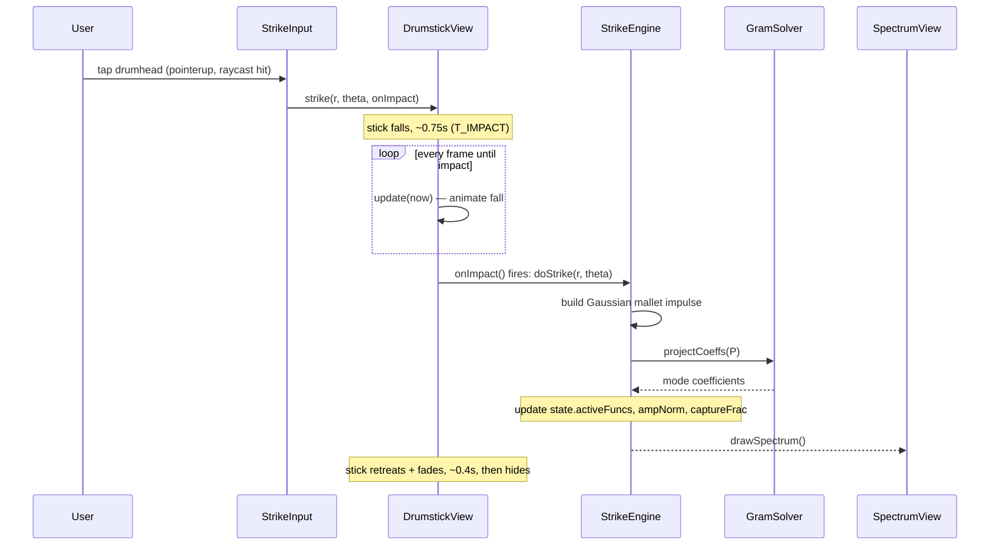
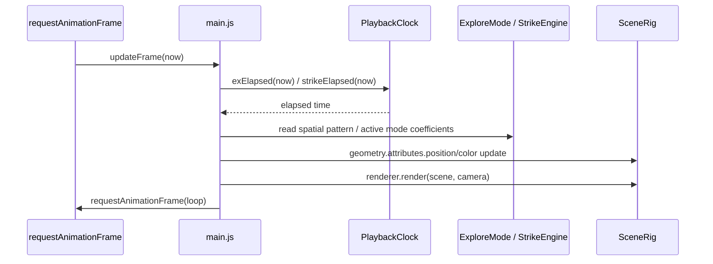
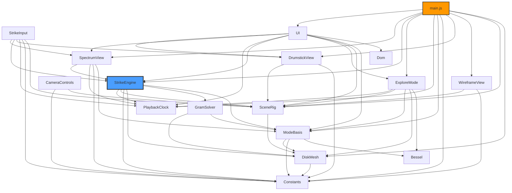

# Architecture Documentation

## Overview

This is a vanilla-JS, three.js-based visualization of a circular drumhead's normal modes and impulse response. The codebase follows a clean separation of concerns across three layers: **core** (physics/math/state), **rendering** (three.js + Canvas2D graphics), and **ui** (DOM wiring).

## Project Structure

```
drum-interact/
├── index.html              # markup + script tags in dependency order
├── style.css
├── src/
│   ├── core/
│   │   ├── constants.js    # Constants: physical/tuning constants
│   │   ├── bessel.js       # Bessel: factorial, besselJ, besselZeros
│   │   ├── mode-basis.js   # ModeBasis: enumerates the (m,n) mode basis
│   │   ├── gram-solver.js  # GramSolver: Gram matrix + Cholesky projection
│   │   ├── playback-clock.js # PlaybackClock: shared animation clock
│   │   ├── explore-mode.js # ExploreMode: explore-mode state + logic
│   │   └── strike-engine.js # StrikeEngine: strike-mode state + physics
│   ├── rendering/
│   │   ├── disk-mesh.js    # DiskMesh: disk mesh + quadrature weights
│   │   ├── scene-rig.js    # SceneRig: three.js scaffold
│   │   ├── wireframe-view.js # WireframeView: coarse polar-grid overlay
│   │   ├── drumstick-view.js # DrumstickView: drumstick model + swing animation
│   │   └── spectrum-view.js # SpectrumView: frequency-spectrum chart
│   └── ui/
│       ├── dom.js          # Dom: `$` getElementById helper
│       ├── camera-controls.js # CameraControls: drag-to-rotate
│       ├── strike-input.js  # StrikeInput: raycasts taps on the 3D drumhead
│       └── ui.js            # UI: panel slider/button wiring
└── main.js                  # boot sequence + render loop
```

## Architecture Layers

### Core Layer (`src/core/`)

**Responsibilities**: Physics, math, and mutable state — no DOM rendering beyond incidental text updates (e.g. reading out a computed value into the `#info` panel).

#### Constants (`constants.js`)
- All physical/tuning constants in one place, with the reasoning behind each documented inline (frequency-cutoff rationale, damping-model derivation, etc.)
- No dependencies.

#### Bessel (`bessel.js`)
- `factorial(k)`, `besselJ(m, x)`, `besselZeros(m, count, maxX)` — pure math, no dependencies, verified against Miller recurrence to ~1e-10.

#### ModeBasis (`mode-basis.js`)
- Enumerates every (m,n) mode with `j_{m,n} <= RATIO_CUT * j_{0,1}` — a disk in k-space, not a rectangle in index space.
- Builds each mode's spatial basis function (`sp`) sampled at every mesh vertex.
- Exposes `groups` (one per distinct (m,n), used for rotation-invariant energy display) and `funcs` (one per basis function, including degenerate cos/sin pairs).

#### GramSolver (`gram-solver.js`)
- Builds the Gram matrix of basis-function overlaps and factors it via Cholesky decomposition.
- `projectCoeffs(P)` solves the true least-squares projection onto the (not-quite-orthogonal) discrete basis, falling back to a diagonal approximation if the Gram matrix isn't positive-definite.

#### PlaybackClock (`playback-clock.js`)
- Owns `state.viewMode`, `state.exPlaying`, `state.speed`, and the two independent elapsed-time accumulators for explore mode and strike mode.
- `exElapsed(now)` / `strikeElapsed(now)` compute elapsed simulation time, accounting for speed changes without retroactively rescaling history. Only explore mode is pausable (`exPlaying` gates `exElapsed`); `strikeElapsed` always progresses in real time — the Pause button lives in the Explore panel only, and a struck membrane should never freeze.

#### ExploreMode (`explore-mode.js`)
- Owns `state.exM`, `state.exN`, `state.exK`, `state.showNodes`.
- `computeExplore()` recomputes the spatial mode shape, rebuilds the nodal-line overlay in `SceneRig.nodalGroup`, and updates the `#info` panel text.

#### StrikeEngine (`strike-engine.js`)
- Owns strike state: `strikeActive`, `strikeR0`/`strikeTh0` (tap position), `ampNorm`, `captureFrac`, `activeFuncs`, `dampAmount`, `radiationOn`.
- `updateDamping()` applies the damping model to every basis function.
- `doStrike(r0, th0)` models a Gaussian mallet impulse, projects it onto the mode basis via `GramSolver`, computes captured energy and per-group energy, and normalizes amplitude. **It never calls a drawing function** — see [Design Patterns](#circular-dependency-avoidance) below.

### Rendering Layer (`src/rendering/`)

**Responsibilities**: three.js scene management and Canvas2D drawing.

#### DiskMesh (`disk-mesh.js`)
- Builds the disk's quadrature mesh: per-vertex radius/angle/quadrature-weight arrays and the triangle index buffer. Foundational — consumed by `ModeBasis`, `GramSolver`, `StrikeEngine`, and `SceneRig` alike.

#### SceneRig (`scene-rig.js`)
- three.js scaffold: scene, camera, renderer, lights, the rotating `rig` group, rim torus, strike marker, the drumhead `BufferGeometry`/`mesh`, and the `nodalGroup` for nodal-line overlays.
- Exposes `resize()` and `colorFor(v)` (the red/white/blue displacement colormap).

#### WireframeView (`wireframe-view.js`)
- Renders a coarse polar grid (a subset of concentric rings + radial spokes, not a per-triangle `wireframe: true` flag) as a separate `THREE.LineSegments` added to `SceneRig.rig`, styled to match the sibling `drum-vibes` project (`0x1a1a22`, ~0.28 opacity, lifted slightly above the surface to avoid z-fighting).
- Ring/spoke indices are chosen as divisors of `Constants.RINGS`/`Constants.SEGMENTS`, so wire vertices coincide exactly with render-mesh vertices — same trick as `drum-vibes/strike.mjs`.
- `update(sourcePos)` copies the live displaced position (plus a small lift) from the main mesh's `BufferAttribute` at just the selected vertex indices — no separate displacement computation, called once per frame from `main.js`'s `updateFrame()`.

#### SpectrumView (`spectrum-view.js`)
- `drawSpectrum()` renders the frequency-spectrum chart: harmonic-comb guide lines, per-mode-group energy spikes (ghosted initial energy vs. current decayed energy), and labels.
- Owns its own `pointerdown` listener for click-to-mute.

#### DrumstickView (`drumstick-view.js`)
- Renders an actual drumstick — a tapered `CylinderGeometry` shaft + `SphereGeometry` tip, added to `SceneRig.rig` — matching the `drum-vibes/strike.mjs` reference build. Hidden until struck.
- `strike(r, th, onImpact)` starts a one-shot swing: the stick falls in on a fixed lean angle (quaternion set once), contacts the head at `T_IMPACT=0.75s`, then retreats and fades out (`~0.4s` total after contact). `update(now)` drives the per-frame position/opacity/visibility from wall-clock elapsed time since the triggering call.
- **The `onImpact` callback is the important part**: it fires exactly on the frame contact happens, not at click time. Callers (`strike-input.js`, `ui.js`'s Re-strike button) use it to delay `StrikeEngine.doStrike()` until the stick visually touches the membrane — otherwise the surface would react before the stick arrives.
- Reads the live displaced position at the strike vertex (`surfaceY()`, same index math as `WireframeView`) so the tip rides whatever the membrane is doing at that instant — including still-decaying motion from a *previous* strike, since the new strike's physics hasn't fired yet during the fall.

#### SpectrumView (`spectrum-view.js`)
- `drawSpectrum()` renders the frequency-spectrum chart: harmonic-comb guide lines, per-mode-group energy spikes (ghosted initial energy vs. current decayed energy), and labels.
- Owns its own `pointerdown` listener for click-to-mute.

### UI Layer (`src/ui/`)

#### Dom (`dom.js`)
- The `$ = id => document.getElementById(id)` helper, used consistently by every module that touches the DOM (the original single-file version used this inconsistently).

#### CameraControls (`camera-controls.js`)
- Owns drag state and `applyRotation()`; wires its own pointer listeners on the renderer's canvas and `window`.

#### StrikeInput (`strike-input.js`)
- Raycasts pointer taps directly onto the 3D drumhead (`THREE.Raycaster` against `SceneRig.mesh`), replacing an earlier separate flat 2D pad. Only active when `PlaybackClock.state.viewMode === 'strike'`.
- Disambiguates a tap from a drag purely by total pointer movement between `pointerdown` and `pointerup` (`CLICK_MOVE_THRESHOLD`, 6px) — below it, raycasts and strikes; above it, does nothing (it was a `CameraControls` drag). The two listener sets coexist independently on the same canvas without needing to coordinate.
- Converts the raycast hit point to the mesh's local space (`mesh.worldToLocal`) to recover `(r, θ)` in the same units `StrikeEngine`/`DiskMesh` use, then calls `DrumstickView.strike(r, th, onImpact)` — it does **not** call `StrikeEngine.doStrike()` directly; that only happens inside the `onImpact` callback.

#### UI (`ui.js`)
- `initUI()` wires every panel slider/button (mode sliders, speed, play/pause, damping, harmonic comb toggle, radiation toggle, mute/re-strike, mode-switch buttons), calling into whichever module owns the relevant state.
- Mode-switch handlers also update `#canvasHint`'s text and the canvas cursor style (`grab` in Explore, `pointer` in Strike) as a lightweight affordance that the drumhead itself is now the input surface.

### Application Layer (Root Directory)

#### main.js
- Owns `updateFrame(now)`, the per-frame vertex displacement/color update for both explore and strike modes, followed by `WireframeView.update(pos)` to keep the grid overlay in sync.
- Boot sequence: calls `UI.initUI()`, then `resize()`, `applyRotation()`, `ExploreMode.computeExplore()`, a warm-up `StrikeEngine.doStrike()`, and initial draws. The warm-up strike deliberately does **not** trigger `DrumstickView.strike()` — it's just pre-warming state before the user has interacted, not a user-visible strike.
- Registers the `window resize` listener (calls both `SceneRig.resize()` and `SpectrumView.drawSpectrum()` — kept here rather than in `scene-rig.js` to avoid `SceneRig` depending on `SpectrumView`).
- The `requestAnimationFrame` render loop: calls `updateFrame`, then `DrumstickView.update(t)`, throttles a live spectrum redraw while a damped strike is decaying, and renders the three.js scene.

## Data Flow

### Strike Flow

The physics deliberately does **not** fire at click time — only once the drumstick visually contacts the membrane, ~0.75s later. `DrumstickView` owns that timing; `StrikeInput` just starts the swing and hands it a callback.



### Render Loop Flow



## Design Patterns

### IIFE Module Pattern

All modules use Immediately Invoked Function Expressions for encapsulation, matching the sibling `spatial-synthesizer` project's convention:

```javascript
const ModuleName = (function () {
  const state = { /* ... */ };
  function doSomething() { /* ... */ }
  return { state, doSomething };
})();
```

**Why**: Provides module-like encapsulation without requiring a build system — the whole app still opens with a plain `<script>` tag per file.

### Per-Concern State Objects

Each module that has mutable state owns one small `state` object (`ExploreMode.state`, `StrikeEngine.state`, `PlaybackClock.state`, `CameraControls.state`, `SpectrumView.state`), rather than several bare top-level `let`s (as the original single-file version had) or one shared app-wide state blob. ES/IIFE modules can freely mutate properties of an object they don't own the binding for, so other modules read/write these directly (e.g. `StrikeEngine.state.dampAmount = v`) without a wrapper API for every field.

**Why**: Keeps each state's authoritative home next to the function that most often mutates it, avoiding both variable-scattering (the original file declared related state in three separate places) and the hidden-coupling risk of one giant shared state object.

### Circular-Dependency Avoidance

`StrikeEngine` is a physics leaf: `doStrike()` computes mode coefficients and updates its own state, but never calls `SpectrumView.drawSpectrum()` directly (the original single-file version did this inline). Instead, every call site that triggers a strike — `StrikeInput`'s pointerup handler, `UI`'s Re-strike button — calls `StrikeEngine.doStrike()` (via `DrumstickView`'s `onImpact` callback, see below) and then explicitly redraws. This keeps `StrikeEngine` strictly below `SpectrumView` in the dependency graph, with no back-edge. The same reasoning kept the `window resize` listener in `main.js` rather than `SceneRig` (which would otherwise need to know about `SpectrumView`).

A related but distinct rule governs `DrumstickView`: it owns the *timing* of a strike (the swing animation), while `StrikeEngine` owns the *physics*. `StrikeInput` never calls `StrikeEngine.doStrike()` itself — it only calls `DrumstickView.strike(r, th, onImpact)`, and `DrumstickView` invokes `onImpact` (which does call `doStrike()`) exactly on the animation frame contact occurs. This keeps the ~0.75s swing-to-impact delay in one place rather than duplicated via a separate timer at each call site.

## Module Dependencies



No back-edges: `StrikeEngine`, `ExploreMode`, and `CameraControls` never import each other or `SpectrumView`. `SpectrumView` only depends downward on `StrikeEngine`. `StrikeInput` depends on `DrumstickView` (never the reverse — `DrumstickView` doesn't know who triggers it, it just exposes `strike()`/an `onImpact` hook). `UI` and `main.js` are the only modules with broad fan-in.

## Adding New Features

### Adding a New Physical Parameter

1. Add it to [`src/core/constants.js`](src/core/constants.js) with a comment.
2. Reference it from whichever module needs it via `Constants.YOUR_CONSTANT`.

### Adding a New UI Control

1. Add the HTML control to [`index.html`](index.html).
2. Wire its listener in `initUI()` in [`src/ui/ui.js`](src/ui/ui.js), following the pattern of reading/writing the owning module's `state` and calling its update function.

### Adjusting the Damping Model

1. Edit the coefficients (`D_A0`, `D_A1`, `D_RAD`, `D_MAX`, `D_CLAMP`) in [`src/core/constants.js`](src/core/constants.js).
2. The application of the model is in `updateDamping()` in [`src/core/strike-engine.js`](src/core/strike-engine.js).

### Adjusting the Wireframe Grid

1. `RING_STEP`/`SPOKE_STEP` (density), `WIRE_COLOR`/`WIRE_OPACITY` (styling), and `WIRE_LIFT` (z-fighting offset) are local constants at the top of [`src/rendering/wireframe-view.js`](src/rendering/wireframe-view.js).
2. Keep `RING_STEP`/`SPOKE_STEP` as divisors of `Constants.RINGS`/`Constants.SEGMENTS` so wire vertices stay exactly on render-mesh vertices.

### Adjusting the Drumstick Swing

1. Shape/color (`STICK_L`, `TIP_R`, `woodMat`/`tipMat`), lean angle (`LEAN`), and timing (`DROP`, `T_IMPACT`, `FADE_START`, `FADE_END`, `HIDE_AT`) are all local constants at the top of [`src/rendering/drumstick-view.js`](src/rendering/drumstick-view.js).
2. If you change `T_IMPACT`, nothing else needs updating — every caller delays `StrikeEngine.doStrike()` via the `onImpact` callback rather than a hardcoded delay, so the physics stays in sync with the new timing automatically.

## Key Principles

1. **No Direct DOM Manipulation in Pure-Math Modules**: `Bessel`, `ModeBasis`, and `GramSolver` never touch the DOM.
2. **Single Source of Truth Per Concern**: each state object lives in exactly one module.
3. **Unidirectional Physics → Rendering Flow**: `StrikeEngine`/`ExploreMode` never call into `SpectrumView`/`SceneRig` drawing functions; only the orchestrating call sites (`StrikeInput`, `UI`, `main.js`) do.
4. **Animation timing lives with the animation, not the caller**: the swing-to-impact delay is owned entirely by `DrumstickView`, exposed via an `onImpact` callback rather than callers each running their own timer.
5. **Script load order is the dependency graph** — `index.html`'s `<script>` order must match it, since there's no bundler to resolve imports.

## Browser Compatibility

- Requires WebGL support for three.js rendering.
- Modern ES6+ JavaScript (no transpilation).
- No build step required.
- No `fetch()` calls, so — unlike some sibling standalone pieces — this one works over `file://` as well as `http://`.
